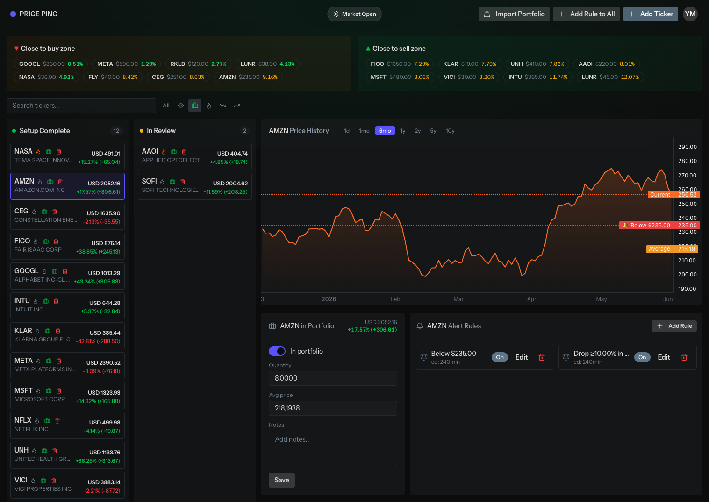

# Price Ping

A self-hosted stock price monitor. Create smart alert rules, get Telegram pings when they fire, and let your AI agent review prices and market context via MCP. Powered by free Yahoo Finance data, with live updates streaming to a dashboard.



## ✨ Features

- 📈 **Ticker tracking** — add symbols by ticker, flag them as *hot* (watchlist) or *in portfolio*, store quantity & average price, view 1M / 3M / 6M / 1Y charts.
- 📂 **Portfolio CSV import** — bulk-load your holdings in one shot.
- 🔔 **Smart alert rules** — two rule types: *threshold* (price crosses a level, above or below) and *percent change* (X% over N hours, up / down / either). One-shot or recurring, with per-rule cooldowns to stop alert spam.
- 📡 **Live dashboard** — prices and market status (pre-market / open / after-hours / closed) are pushed over WebSockets.
- 💬 **Telegram notifications** — formatted alerts delivered to a Telegram chat the instant a rule triggers.
- 📊 **Price digests** — scheduled digest reports for rules approaching their thresholds.
- 🤖 **MCP server** — exposes your portfolio to Claude (and other MCP clients) so the model can research positions and propose alert rules directly.

## 🚀 Installation

Requirements:

- Docker (recommended path, via Laravel Sail), **or**
- PHP 8.5 + Node 20+ + MySQL 8.4 + Redis if you'd rather run natively.

Steps:

1. Clone the repo.
2. Copy the env file: `cp .env.example .env`.
3. Fill in the env vars from the [Integrations](#-integrations) section below — at minimum `TELEGRAM_BOT_TOKEN`, `TELEGRAM_CHAT_ID`, and the `REVERB_*` keys.
4. Boot the stack with Sail (brings up the app, MySQL, Redis, and Reverb):

   ```bash
   sail up -d
   ```
5. Bootstrap the app:

   ```bash
   sail composer run setup
   ```

   This installs PHP & npm deps, generates `APP_KEY`, runs migrations, and builds frontend assets.
6. In another terminal, run Horizon:

   ```bash
   sail artisan horizon
   ```
7. In another terminal, run the scheduler:

   ```bash
   sail artisan schedule:work
   ```
8. Seed an admin user so you can sign in:

   ```bash
   sail artisan db:seed
   ```

   This creates a verified user with email `admin@example.com` and password `1212qwqw` (defined in `database/seeders/DatabaseSeeder.php`).
9. Seed an admin user so you can sign in:
    Visit http://localhost/dashboard
10. Optional dashboards: **Horizon** at `/horizon` for queue health, **Pulse** at `/pulse` for app metrics.

## 🔌 Integrations

### 📈 Financial data — Yahoo Finance

Price data comes from the unofficial Yahoo Finance endpoints (`query1.finance.yahoo.com`) via `app/Integrations/MarketData/YahooMarketDataProvider.php`. We pull the latest price, name, currency, exchange, market state, and chart history. The provider is wrapped by `CachedMarketDataProvider`, which caches everything in Redis to avoid hammering Yahoo.

Env knobs:

```env
MARKET_DATA_TIMEOUT=10                 # HTTP timeout, seconds
MARKET_DATA_CACHE_SECONDS=600          # cache TTL for ticker data
MARKET_DATA_PRICE_REFRESH_MINUTES=10   # how often the scheduler refreshes prices
MARKET_DATA_STATUS_SYMBOL=SPY          # symbol used to read overall market state
MARKET_DATA_STATUS_CACHE_SECONDS=60    # TTL for the market-state probe
```

**Limitations — read this before you rely on it:**

- Yahoo Finance has no official public API. The endpoints can change, rate-limit, or block your IP without warning.
- Not suitable for commercial use or high-frequency polling.

### 💬 Telegram

Alerts are sent through a Telegram bot (`app/Integrations/Notifications/TelegramNotificationSender.php`). Messages include the ticker symbol, current price, and rule type / direction.

```env
TELEGRAM_BOT_TOKEN=                    # from @BotFather
TELEGRAM_CHAT_ID=                      # chat to receive alerts (DM, or a group with the bot added)
TELEGRAM_API_BASE=https://api.telegram.org
TELEGRAM_TIMEOUT=10
```

### 🧠 Redis

Redis is doing a lot of work here:

- **Cache** (`CACHE_STORE=redis`) — Yahoo Finance responses, market state, chart data.
- **Sessions** (`SESSION_DRIVER=redis`).
- **Queue** (`QUEUE_CONNECTION=redis`) — drives the async price-refresh → rule-check → notify pipeline. Queues are split into `default`, `rules`, and `alerts`, managed by Horizon.
- **Broadcasting backplane** for Reverb.

### 📡 Reverb (WebSockets)

A self-hosted Reverb container (already in `compose.yaml`) broadcasts `TickerPricesRefreshed` and market-status events to the dashboard so prices update live.

```env
REVERB_APP_ID=
REVERB_APP_KEY=
REVERB_APP_SECRET=
REVERB_HOST=reverb
REVERB_PORT=8080
REVERB_SCHEME=http

VITE_REVERB_APP_KEY="${REVERB_APP_KEY}"
VITE_REVERB_HOST=localhost
VITE_REVERB_PORT="${REVERB_PORT}"
VITE_REVERB_SCHEME="${REVERB_SCHEME}"
```

### 🤖 MCP — talk to your portfolio from Claude

Price Ping ships a Laravel MCP server (`app/Mcp/Servers/TickerServer.php`) mounted at `/mcp`. Any MCP-aware client Any MCP-aware client (Claude Desktop, Claude Code, Cursor, …)  can read your tracked tickers and write alert-rule proposals straight into the database. The model becomes a research assistant that sees *your actual portfolio*, not a generic chatbot.

The tools (`app/Mcp/Tools/`):

- **`list_tickers`** — list all tracked tickers with current price, hot / portfolio flags, quantity, and average price.
- **`get_ticker`** — drill into a single symbol: current price, chart history, status, and existing alert rules.
- **`propose_alert_rules`** — write proposed alert rules (threshold or percent-change) for a ticker. The proposals show up on the dashboard, where you approve them in one click. Replaces existing proposals for that ticker.

Example workflows from a Claude chat:

- *"Look at my portfolio and tell me which positions look overextended right now."* → Claude calls `list_tickers`, then `get_ticker` on the interesting ones, then explains its reasoning.
- *"For NVDA, propose two alert rules: a one-shot threshold 5% below current price as a stop-loss check, and a ±3% over 2 hours volatility alert."* → Claude calls `propose_alert_rules` with the structured rule payload; you approve the proposals from the dashboard.
- *"For each of my hot tickers, look at the 1M chart and suggest a tighter alert where the price is hugging a level."*

**Connecting from Claude Desktop** — edit `~/Library/Application\ Support/Claude/claude_desktop_config.json` (macOS) and add:

```jsonc
{
  "mcpServers": {
    "price-ping": {
      "command": "npx",
      "args": [
        "-y",
        "mcp-remote",
        "http://localhost/mcp"
      ]
    }
  }
}
```

Use whatever URL your local app is served at — e.g. `http://price-ping.test/mcp` on Herd / Valet, or the Sail port if you've remapped it. Restart Claude Desktop after editing the config.

**Connecting from Claude Code** — add it via the CLI:

```bash
claude mcp add price-ping --transport http http://localhost/mcp
```

After that, `list_tickers`, `get_ticker`, and `propose_alert_rules` are available in any Claude Code session.

## 🏛 Backend architecture — Pragmatic Laravel Layered Architecture

The `app/` tree is organised by responsibility, not by Laravel-default folder. Each layer has a job and a small set of rules about what goes in it:

- **`Values/`** — small value objects for domain concepts (`TickerSymbol`, `Price`, `PercentChange`). Used when the value carries meaning beyond its raw type.
- **`Data/`** — DTOs that ferry data between layers (`TickerData`, `TriggeredAlert`, `ChartPoint`).
- **`Enums/`** — type-safe enumerations for closed sets of values (`AlertRuleType`, `MarketStatus`, `TickerStatus`, `ChartRange`, `ThresholdDirection`, `PercentDirection`).
- **`Casts/`** — custom Eloquent attribute casts that convert raw DB columns into richer types (e.g. `PriceBaselineCast` for the alert baseline snapshot).
- **`Models/`** — Eloquent models, kept thin (mostly scopes and accessors).
- **`Core/`** — important, reusable, or non-trivial domain logic (alert-rule evaluation, digest builders). The "expensive" layer — code earns its place here only when it's load-bearing.
- **`Actions/`** — use-case orchestration; one class per user-facing operation, coordinating Core + Models + Integrations.
- **`Integrations/`** — adapters to outside services (Yahoo Finance, Telegram), implementing `Contracts/` interfaces so they're swappable and testable.
- **`Contracts/`** — interfaces for DI seams (`MarketDataProvider`, `NotificationSender`, …).
- **`Jobs/` + `Events/` + `Listeners/`** — the async pipeline: refresh prices → broadcast → check rules → fire alerts. Listeners stay one-liners; real work is delegated to Core.
- **`Http/`** — controllers and form requests only; no business logic.
- **`Mcp/`** — Laravel MCP server (`TickerServer`) and its tools (`ListTickersTool`, `GetTickerTool`, `ProposeAlertRulesTool`); see the [MCP section](#-mcp--talk-to-your-portfolio-from-claude) above.
- **`Providers/`** — service container wiring: `AppServiceProvider` binds the `Contracts/` interfaces to their `Integrations/` implementations, plus `FortifyServiceProvider` and `HorizonServiceProvider`.
